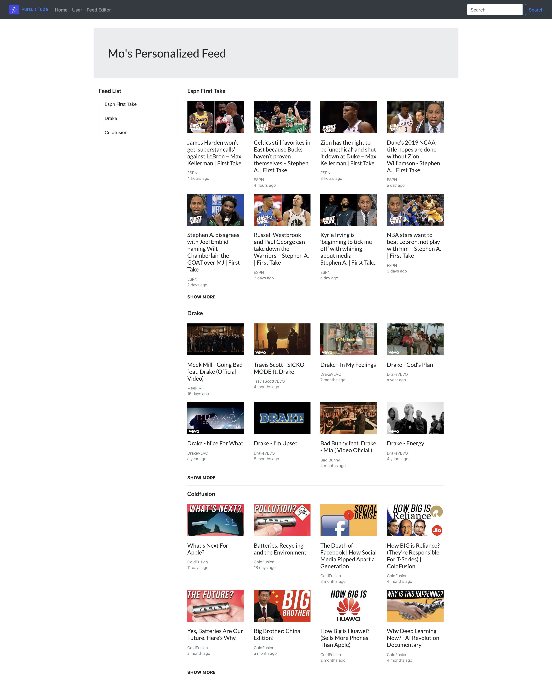
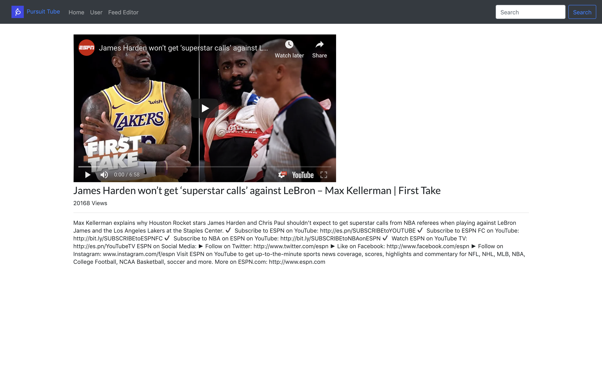
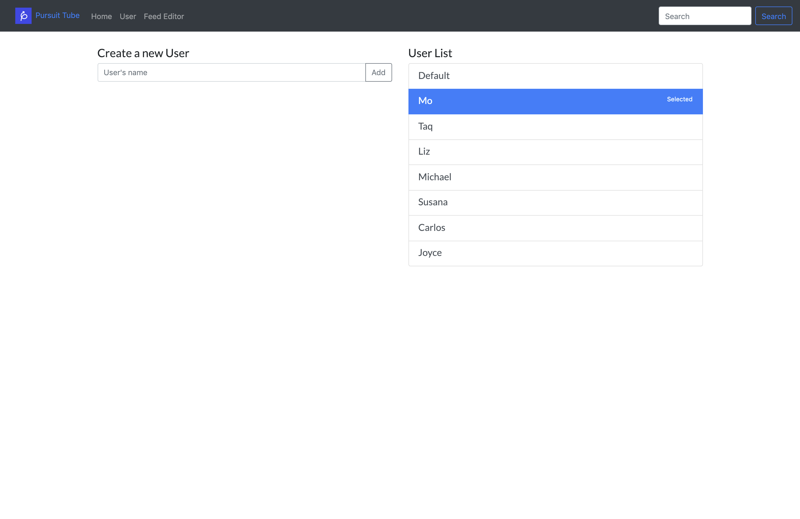
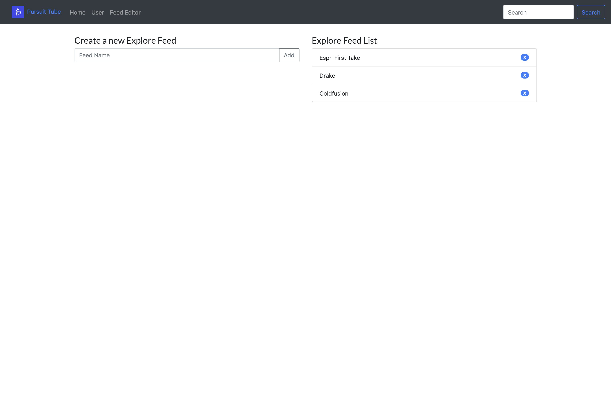

# React: Lab 3
## Pursuit Tube 

### Task
- You will create a Single Page Application (SPA) that mimics the offical Youtube webapp
- You will use the official `Youtube Data API v3`
  - `https://developers.google.com/youtube/v3/docs/`
- Your app must make use of `React Router v4`
- Your app may NOT use any other dependencies other than the following:
  - [Axios](https://www.npmjs.com/package/axios)
  - [Moment](https://momentjs.com/)
  - [React-Router-Dom](https://www.npmjs.com/package/react-router-dom)
  - [Bootstrap](https://getbootstrap.com/)
    - Or equivalent UI frameworks like SemanticUI / Reactstrap
  - Create-React-App ... **obviously**
  - Using any thing else will mean your Lab is incomplete
- Your app **MUST** make use of LocalStorage to implement some of the features

### Required Featues


#### Header (Logo, Links and Search)

- Should be on EVERY page of the application
- Shows a logo
- Shows link to the following:
  - Home
  - User
  - Feed Editor
- Shows search bar
  - Pressing 'Search' takes you to the Search page

#### Home: `/`



- Shows the current selected user's personalized feed
- Shows the list of feeds the user has specifically selected
- Shows the Explore for each of the feeds
  - Each explore section should show loading before the data has arrived
  - Needs to be styled exactly like in the image. 4x2 initially.
  - Clicking **SHOW MORE** loads 4 more below the current list
- Each Explore section MUST show the following data for each video:
  - Thumbnail image
  - Title of video
  - Channel Name
  - Time it was posted relative to now. (Use Moment.js)
- Clicking on the video takes you to that video's page

#### Video: `/video/:video_id`



- Shows the following data:
  - Youtube Iframe Video Player with specific video
  - Video title
  - Video Views
  - Video description

#### Search: `/search/:search_query`


- Display what is the search query
- Gather 10 videos
- Display in a list all the results of the search
- Each Explore section MUST show the following data for each video:
  - Thumbnail image
  - Title of video
  - Channel Name
  - Time it was posted relative to now. (Use Moment.js)
- Clicking on the video takes you to that video's page
- SHOW MORE button to load the next result of search, load 10 more
- **Infinite Scroll is optional, but would be really cool right? ;)**

#### User List / Editor: `/user`



- Needs to have a form to add new Users
- Can't add the same user twice. Give an alert
- Needs to list all the users registered
- Needs to indicate which is the current **ACTIVE** user
  - Needs to indicate through background color
  - Also needs to indicate through the text 'selected'
- Clicking on the other names switches the Selected user
  - This change reflects across the entire website 

#### Feed List / Editor: `/feededitor`



- Shows ONLY the feed for the **CURRENT USER**
- Needs to have form to add new Feed
- Needs the ability to remove the Feed from the list
- Should reflect on the Home page 


### Optional Features

#### History: `/user/:user_id/history`

- Lists all the videos watched in reverse chronological order for the **CURRENT SELECTED** user
- Use the UI for the search page to show and list the watched videos

#### Reset All Data

- Will reset the platform
- Removes all Users, Feeds etc
- Shows Default user with 'Music' feed

#### Comments List for Video

- Use the YouTube API to display all the Comments and Comment Threads for that video
- Display this on the specific video's page

### Youtube API

#### Sign up for API KEY

1. **Create Project**: `https://console.developers.google.com/projectcreate`
2. **Enable Youtube Data API v3**: `https://console.developers.google.com/apis/library/youtube.googleapis.com`
3. **Create API Key**: `https://console.developers.google.com/apis/credentials/wizard?api=youtube.googleapis.com`
4. **HTTP Referrers**: Set the HTTP referrers (websites) to `*` so any client can access it

#### Searching API

**You will be using this API for the search results AND explore results.**

**`https://www.googleapis.com/youtube/v3/search`**

Docs: [https://developers.google.com/youtube/v3/docs/search/list](https://developers.google.com/youtube/v3/docs/search/list)

How to use: 

```javascript
axios({
  method: 'get',
  url: 'https://www.googleapis.com/youtube/v3/search',
  params: {
    part: 'snippet',
    maxResults: 8,
    videoDefinition: 'high',
    type: 'video',
    videoEmbeddable: 'true',
    key: YOUR_API_KEY,
    q: SEARCH_QUERY,
    pageToken: ''
  }
})
.then()
```

#### Displaying Youtube Video

You can just use and modify the following: 

```javascript
import React from 'react';

const VideoPlayer = ({ id }) => {
  const link = `https://www.youtube.com/embed/${id}?autoplay=1&fs=1&origin=http://localhost:3000`;

  return (
    <iframe title='yt-video' type="text/html" width="640" height="360"
  src={link} frameBorder="0"></iframe>
  );
}

export default VideoPlayer;
```

#### Getting Specific Video Details

Returns the views, description etc of a video

```javascript
axios({
  method: 'get',
  url: 'https://www.googleapis.com/youtube/v3/videos',
  params: {
    part: 'id,snippet,statistics',
    key: YOUR_API_KEY,
    id: VIDEO_ID,
  }
})
```

### App Structure

```
/src
  /components
  /containers
  /services
```

- **Components:** All your standalone components. Like the VideoPlayer above
- **Containers:** Components 